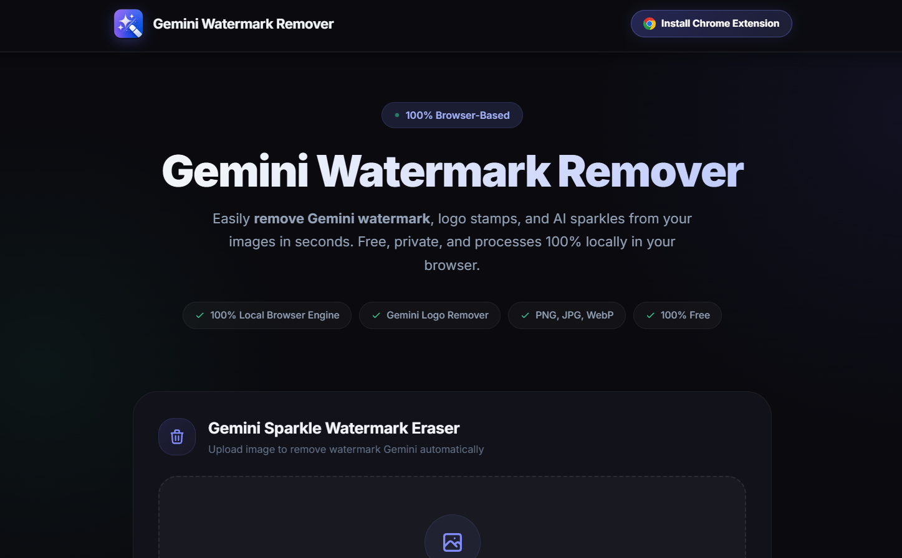

# 🪄 Gemini Watermark Remover

> **Free, fast, and 100% client-side web application to remove Gemini watermark, logo stamps, and AI sparkles from your images with pixel precision.**

[](https://opensource.org/licenses/MIT)
[](#-privacy--security)
[](https://chromewebstore.google.com/detail/mjchnnjhmkopaoiaihnfpcacdkpkpink?utm_source=item-share-cb)

> [!WARNING]
> **Legal Protection & Anti-Scraping Policy**: Unauthorized scraping, automated data harvesting, content extraction, re-hosting, or commercial redistribution of this project's source code, assets, or algorithms is strictly prohibited. Violators will face immediate legal action under international copyright laws and digital asset protection acts.

---



---

## 🚀 Try These Tools

Enhance your workflow with our full suite of free watermark removal tools and browser extensions:

* 🖼️ **[Gemini Watermark Remover (Web App)](https://www.oneshotseo.com/gemini-watermark-remover/)**  
  *Access the advanced online image watermark eraser with side-by-side comparison and zero quality loss.*

* 🎥 **[Gemini Video Watermark Remover](https://www.oneshotseo.com/gemini-video-matermark-remover/)**  
  *Remove AI watermark stamps, logos, and overlays from Gemini AI-generated videos online.*

* 🧩 **[Gemini Watermark Remover Chrome Extension](https://chromewebstore.google.com/detail/mjchnnjhmkopaoiaihnfpcacdkpkpink?utm_source=item-share-cb)**  
  *Install our official Google Chrome Extension directly from the Chrome Web Store for one-click removal anywhere.*

---

## ✨ Key Features

- 🔒 **100% Private & Local Processing**: All image rendering and pixel manipulation occur locally inside your browser using HTML5 Canvas & WebGPU/CPU. No photos are ever uploaded or stored on external servers.
- 🎯 **Pixel-Precise Alpha Reversal**: Calibrated algorithm targets the exact semi-transparent alpha overlay of Gemini AI logos, leaving underlying image resolution, detail, and colors intact.
- ⚡ **Instant Processing**: Clean watermarks in less than 2 seconds without cloud queue delays.
- 👁️ **Interactive Before & After View**: Compare cleaned results, original watermarked images, or inspect live side-by-side dual previews.
- 🖼️ **Universal Format Support**: Compatible with PNG, JPG, JPEG, and WebP images.
- 📱 **Fully Responsive**: Seamlessly works on desktop (Chrome, Firefox, Safari, Edge) and mobile browsers.

---

## 🛠️ How It Works

Google's Gemini AI embeds a semi-transparent sparkle logo overlay onto generated images. Standard watermark tools often blur or smudge large surrounding areas, degrading photo quality.

Our **Gemini Watermark Remover** uses **Normalized Cross-Correlation (NCC)** and calibrated opacity maps to:
1. Detect the exact coordinates and margin bounds of the Gemini sparkle stamp.
2. Mathematically reverse the alpha channel blend applied during generation.
3. Restore original underlying color channels without blurring or loss of sharpness.

---

## 💻 Local Quick Start

Since this project runs 100% client-side, no server setup or node build step is required!

1. **Clone the Repository**:
   ```bash
   git clone https://github.com/mrsanjayrajshah/gemini-watermark-remover.git
   cd gemini-watermark-remover
   ```

2. **Run Locally**:
   Open `index.html` directly in any web browser or use a lightweight local server:
   ```bash
   npx serve .
   ```

3. **Deploy to GitHub Pages**:
   Simply push `index.html`, `script.js`, and `assets/` to your `main` branch and enable **GitHub Pages** under repository settings.

---

## 👤 Developer & Credits

- **Developed By**: [Sanjay Raj Shah](https://github.com/mrsanjayrajshah/gemini-watermark-remover)
- **Powered By**: [Gemini Watermark Remover](https://www.oneshotseo.com/gemini-watermark-remover/) technology by OneShotSEO.

---

## ⚖️ Anti-Scraping & Intellectual Property Notice

All content, branding, UI designs, code architecture, and proprietary algorithms associated with this project are protected by intellectual property laws.

- 🚫 **No Scraping or Data Harvesting**: Automated scraping, web crawling, or extraction of project assets, links, and algorithms is strictly forbidden.
- 🚫 **No Unauthorized Re-Hosting / Mirroring**: Re-publishing or operating identical clone domains without explicit prior written authorization is prohibited.
- ⚖️ **Legal Enforcement**: Any unauthorized scraping, intellectual property theft, or commercial misuse will be met with immediate legal action, DMCA takedown notices, and enforcement proceedings.

---

## 📄 License

This project is licensed under the [MIT License](LICENSE) - free for personal and commercial use.

*Disclaimer: This utility is an independent open-source tool for personal image editing and is not affiliated with or endorsed by Google LLC.*
